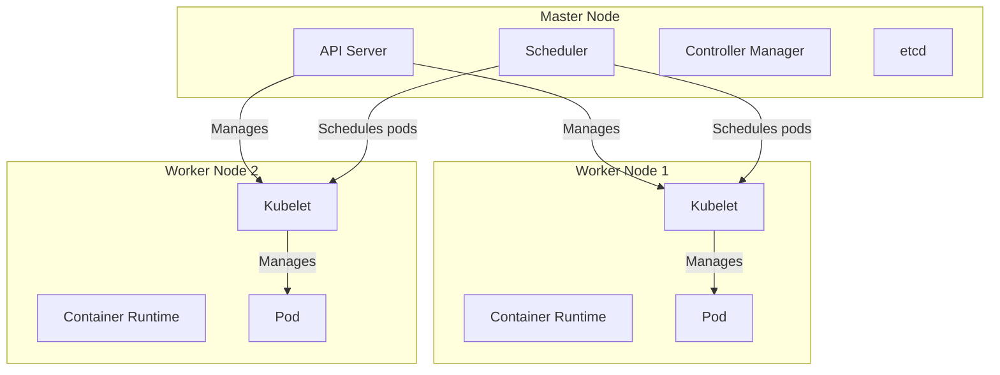

# Kubernetes Notes

## What is Kubernetes?
Kubernetes, also known as K8s, is an open-source system for automating deployment, scaling, and management of containerized applications.

## Kubernetes Architecture
Kubernetes follows a client-server architecture. It has a master node and multiple worker nodes.

- **Master Node:** The master node is the control plane of the Kubernetes cluster. It consists of components like the API server, scheduler, controller manager, and etcd.
- **Worker Node:** Worker nodes are the machines where the actual workloads run. Each worker node has a Kubelet, which is an agent for managing the node and communicating with the master.

## Key Concepts
- **Cluster:** A set of nodes that run containerized applications.
- **Node:** A worker machine in Kubernetes, previously known as a minion.
- **Pod:** The smallest and simplest unit in the Kubernetes object model that you create or deploy. A Pod represents a running process on your cluster.
- **Service:** An abstract way to expose an application running on a set of Pods as a network service.
- **Deployment:** A controller that provides declarative updates for Pods and ReplicaSets.
- **ReplicaSet:** Ensures that a specified number of pod replicas are running at any given time.

## Local Kubernetes Clusters
For practicing Kubernetes locally, you can use one of the following tools to set up a local cluster:
- **Minikube:** A tool that runs a single-node Kubernetes cluster on your personal computer.
- **Kind:** A tool for running local Kubernetes clusters using Docker container "nodes".

## Practice Playgrounds
To get hands-on experience with Kubernetes, you can use these free online playgrounds:
- [Killercoda Kubernetes Playground](https://killercoda.com/kubernetes)
- [KodeKloud Kubernetes Playground](https://kodekloud.com/p/kubernetes-playground)
